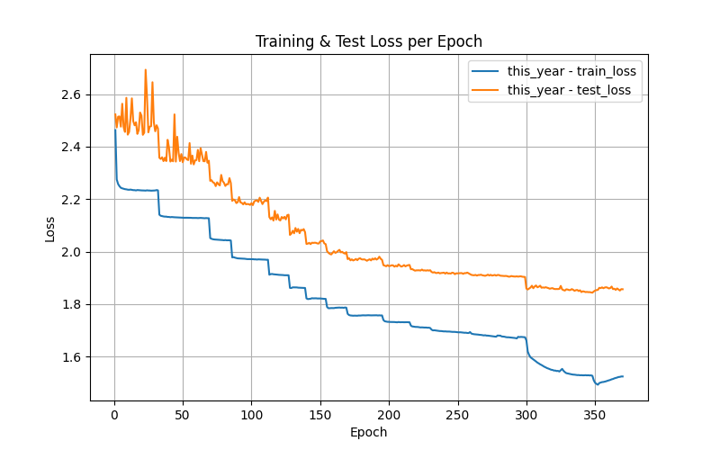
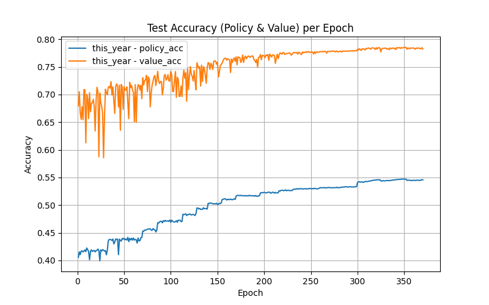
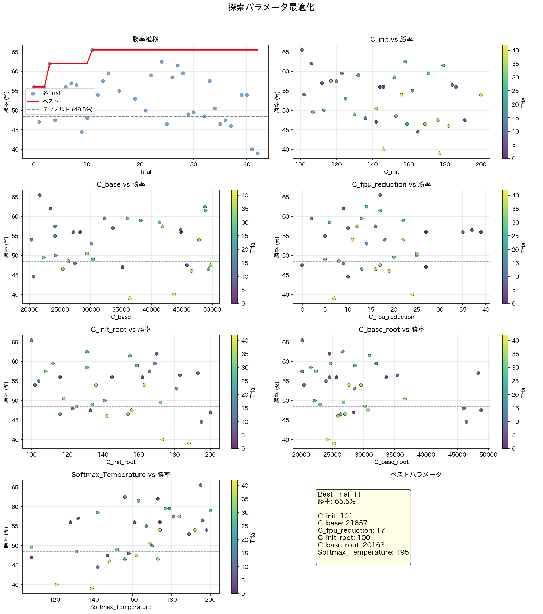
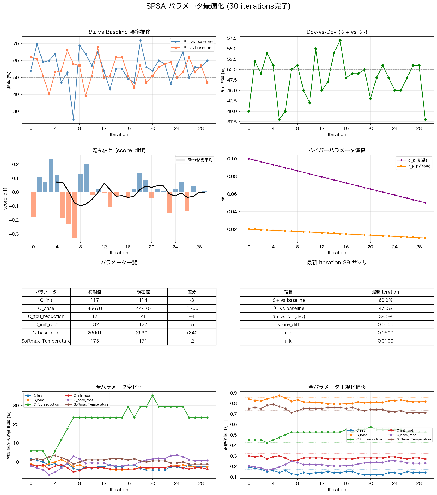

# ponkotsu詳細アピール文書 補足資料：プロット結果

本資料は「ponkotsu詳細アピール文書」(WCSC36)の補足資料である。詳細アピール文書本体では紙面の都合上掲載できなかったグラフ・対局検証データをまとめた。

---

## lossの推移

348エポック全体を通じたloss(損失)の推移である。

**読み取り**:

**事前学習フェーズ(0～299 epoch)**：
- lossが急速に減少しており、大規模データによる基礎的な特徴抽出が効果的に進行したことがわかる
- ウォームアップなしの高い初期学習率(0.2)により積極的に最適化が進んだ

**Phase1 追加学習フェーズ(299～326 epoch)**：
- lossの低下速度が大きく低下し、より細かいチューニングへシフトしたことがわかる
- 学習率を2000倍下げたことで、CosineLRSchedulerによる周期的な最適化戦略が機能した

**Phase2 追加学習フェーズ(326～348 epoch)**：
- lossがさらに緩やかに減少し、最終的な収束へ向かった
- 改善幅が徐々に小さくなり、最適値への収斂を示した

3つのフェーズが明確に区別でき、各フェーズでの学習戦略(学習率の値、スケジューラの選択)がloss曲線の形状に直結していることが読み取れる。

## accuracyの推移

評価用データセット(floodgate_test_2017-2018_r3500_eval5000.hcpe)上でのaccuracy(正解率)の推移である。

**読み取り**:

**事前学習フェーズ(0～299 epoch)**：
- 基礎的な局面判断能力を急速に獲得した

**Phase1 追加学習フェーズ(299～326 epoch)**：
- 改善速度は鈍化したが、実戦データの特性に基づいたより正確な学習が進行した
- 事前学習データと比べ、追加学習では高ノード数で探索された棋譜を使用しており、データの質が高い
- そのため、データ量は事前学習の約27億局面に対し約3.3億局面と大幅に少ないにもかかわらず、正解率が着実に向上した

**Phase2 追加学習フェーズ(326～348 epoch)**：
- 正解率がさらに微細に改善し、最終的にPolicy Accuracy 54.7%、Value Accuracy 78.4%に到達した
- 引き続き高品質なデータの追加により正解率向上に寄与した

初期段階での急速な改善から、段階的な精密化への移行が明確に視覚化されている。

---

## Optunaによるパラメータ探索結果

Optunaによるパラメータ探索の結果を示す2次元散布図行列(pairplot)である。複数のパラメータの組合せと、それぞれに対応する勝率の関係が可視化されている。

**読み取り**:
- 高勝率領域(65%以上)が明確に存在し、最適なパラメータセットが見つかっている
- 濃い色から明るい色への移動パターンから、Optunaの探索が効果的に最適値へ収斂していることがわかる
- 特定パラメータ値への集中が見られ、複数パラメータ間の相互作用をOptunaが捉えている

## SPSAによる微調整(検証の結果、不採用)

Optunaによる探索で見つかった領域をSPSA(Simultaneous Perturbation Stochastic Approximation)でさらに微調整した際の進行を示す。

**読み取り**:
- 全体的に上昇傾向があり、SPSAによる勾配推定が機能した
- 確率的な変動を伴いつつ、終盤では最適値付近で安定化した

### 採用判断：Optunaで調整したパラメータを採用

SPSAで調整したパラメータについて、Optunaで調整したパラメータおよびWCSC35版ponkotsu(ResNet30x256)とリーグ戦による対局検証を行った。やねうら王互角局面集2025を初期局面とし、2分+2秒フィッシャーで各組み合わせ200局(計600局)を対局させた結果は以下の通りである。

**レーティング比較**:

| # | PLAYER | RATING | ERROR | POINTS | PLAYED | (%) | W | D | L | D(%) |
|---|--------|--------|-------|--------|--------|-----|---|---|---|------|
| 1 | ponkotsu_wcsc36_optuna | +33.6 | 22.2 | 228.0 | 400 | 57 | 202 | 52 | 146 | 13 |
| 2 | ponkotsu_wcsc36_spsa | +25.8 | 21.5 | 221.5 | 400 | 55 | 199 | 45 | 156 | 11 |
| 3 | ponkotsu_wcsc35 | -59.5 | 22.6 | 150.5 | 400 | 38 | 126 | 49 | 225 | 12 |

**直接対決**:

| 対戦カード | 勝敗 | 勝率(%) |
|---|---|---|
| optuna vs spsa | 89勝87敗24分 | 50.5 |
| optuna vs wcsc35 | 113勝59敗28分 | 63.5 |
| spsa vs wcsc35 | 112勝67敗21分 | 61.3 |

直接対決は89勝87敗24分(勝率50.5%)とほぼ互角であったが、レーティングではOptuna調整が+33.6、SPSA調整が+25.8とSPSA調整がやや劣った。また、WCSC35版との対戦でもOptuna調整(63.5%)がSPSA調整(61.3%)を上回ったため、**Optunaで調整したパラメータを採用**した。

SPSAがOptuna調整を上回れなかった要因として、1回のパラメータ更新あたりの対局数の差が考えられる。Optunaでは各試行で基準ソフトと1手2秒100局を対局させており、勝率の推定精度が比較的高い。一方SPSAでは、θ+およびθ-それぞれが基準ソフトと1手2秒50局、さらにθ+ vs θ-で50局を対局させる構成であり、各パラメータの勝率推定に用いる対局数がOptunaの半分であった。この対局数の差により勝率のブレが大きくなり、勾配推定の精度が低下したと考えられる。
